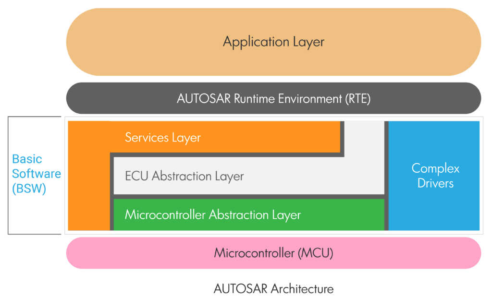
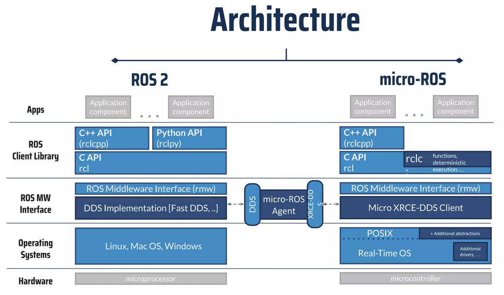
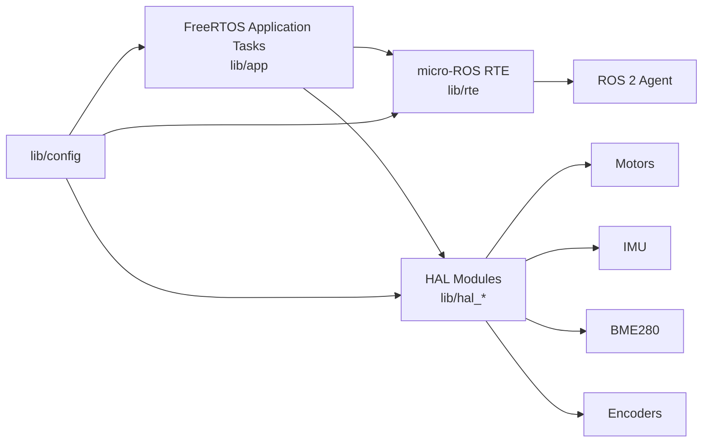

# upio-ros2

ESP32-S3 firmware for the Kukulcan MCU using PlatformIO, Arduino, FreeRTOS, and micro-ROS.

## Scope

This firmware is the current embedded integration path between the MCU hardware and the ROS 2 stack. It already includes:

- micro-ROS transport setup
- `cmd_vel` consumption
- motor control tasking
- encoder publishing
- IMU publishing
- barometer publishing
- status LED handling

The architecture itself is a primary feature of this firmware: a micro-ROS and FreeRTOS compatible AUTOSAR-style separation between application logic, runtime integration, hardware abstraction, and deterministic task scheduling.

## AUTOSAR-style architecture

This project intentionally emphasizes architecture, not only peripheral bring-up. The firmware follows an AUTOSAR-inspired layered model adapted to the ESP32-S3 and rover use case:

- application layer: mission-facing logic and task orchestration
- runtime environment: controlled interface between application behavior and ROS communication paths
- service and abstraction layers: reusable system services and ECU-facing abstractions
- microcontroller and hardware-facing layers: board-specific buses, peripherals, and device drivers

In repository terms, that maps roughly to:

| Layer intent | Current implementation |
| --- | --- |
| Application Layer | `lib/app/` and its FreeRTOS task model |
| AUTOSAR Runtime Environment | `lib/rte/`, implemented around micro-ROS |
| ECU abstraction and complex drivers | `lib/hal_*`, parts of `lib/config/` |
| MCU-specific configuration | `lib/config/`, board definition, Arduino/ESP32 interfaces |

This architectural separation is already part of the validated firmware value and should be described as a deliberate beta feature, not just an internal code organization choice.

In practical terms for this project:

- the RTE layer is essentially the micro-ROS integration boundary
- the application layer is effectively expressed through coordinated FreeRTOS tasks
- the lower layers hold the hardware-specific behavior needed to keep the application side portable and organized

## micro-ROS implementation significance

This firmware also demonstrates a reliable implementation of micro-ROS on top of FreeRTOS with the Arduino framework on ESP32-S3 hardware. That matters because current documentation around this combination is still weaker than the more common reference paths.

For this project, that combination is not experimental anymore. It is part of the validated embedded stack and materially lowers the integration barrier for rover development by:

- simplifying embedded ROS 2 adoption on the target MCU
- preserving a practical Arduino-based development flow
- keeping deterministic task partitioning through FreeRTOS
- exposing ROS communication through an architecture-aligned RTE layer

## Architecture diagrams

### AUTOSAR-inspired layering



AUTOSAR-inspired layering used by the firmware. In this project, the runtime environment is effectively realized through micro-ROS and the application layer is expressed through coordinated FreeRTOS tasks.

### micro-ROS stack reference



micro-ROS architecture reference for the implemented FreeRTOS plus Arduino stack on the ESP32-S3 target.

## Layout

| Path | Purpose |
| --- | --- |
| `src/main.cpp` | Arduino entry point |
| `lib/app/` | task creation and scheduling |
| `lib/rte/` | micro-ROS runtime integration |
| `lib/config/` | hardware pins, buses, queues, and shared objects |
| `lib/hal_*` | hardware abstraction modules for motors, encoders, IMU, altitude, and status LEDs |
| `platformio.ini` | PlatformIO environment and dependencies |

## Runtime model

The current architecture follows the intent described in `AGENTS.md`:

- one task services micro-ROS executor work
- one publisher task emits cached sensor data at fixed periods
- one motor task consumes `cmd_vel` messages and applies a timeout stop
- sensor work lives in dedicated HAL tasks instead of inside the executor

This is a solid direction for beta hardening because it keeps sensor access and ROS communication separated.

## Firmware flow



This diagram reflects the project's practical layering: FreeRTOS tasks drive application behavior, `lib/rte` exposes the micro-ROS communication boundary, and HAL modules own the hardware-facing work.

## Build

```bash
cd kukulcan/firmware/upio-ros2
pio run
```

Flash:

```bash
pio run -t upload
```

## Current validation status

Maintainer-reported status for the current beta:

- Firmware status: stable beta, on track toward the first stable release
- Tested hardware: Kukulcan PCB
- Build status: successful `pio run`
- Validation level: thoroughly tested by the maintainer for the current beta scope

Latest confirmed build result provided by the maintainer:

```text
==================== [SUCCESS] Took 10.34 seconds ====================
RAM:   16.0% (used 52568 bytes from 327680 bytes)
Flash: 8.9% (used 420573 bytes from 4718592 bytes)
```

## Transport and agent

Current validated serial agent command:

```bash
ros2 run micro_ros_agent micro_ros_agent serial --dev /dev/ttyACM0 -b 921600
```

The same workflow can also be run from Docker, which is the expected Jetson-side deployment path.

## Validated behavior

- micro-ROS transport and executor integration
- FreeRTOS task partitioning aligned with the firmware architecture
- AUTOSAR-inspired layered firmware structure validated in real implementation
- `cmd_vel` handling for motor commands
- sensor publishing pipeline

## Known beta limitation

- Motor control is still open-loop for `cmd_vel`
- Closed-loop velocity behavior is the main remaining functional item before the first overall stable release
