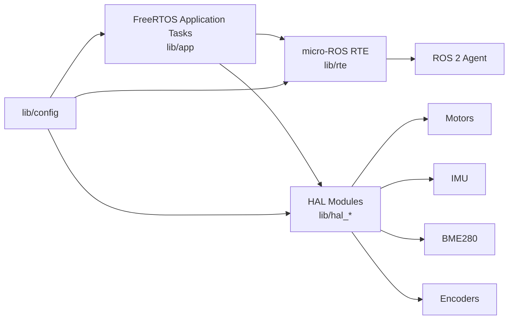

# upio-ros2

ESP32-S3 firmware for the Kukulcan MCU using PlatformIO, Arduino, FreeRTOS, and micro-ROS.

## Scope

This firmware is the current embedded integration path between the MCU hardware and the ROS 2 stack. It already includes:

- micro-ROS transport setup
- `cmd_vel` consumption
- motor control tasking
- encoder publishing
- IMU publishing
- GNSS publishing
- wheel odometry publishing
- barometer publishing
- status LED handling

The architecture itself is a primary feature of this firmware: a micro-ROS and FreeRTOS compatible AUTOSAR-style separation between application logic, runtime integration, hardware abstraction, and deterministic task scheduling.

## AUTOSAR-style architecture

This project intentionally emphasizes architecture, not only peripheral bring-up. The firmware follows an AUTOSAR-inspired layered model adapted to the ESP32-S3 and rover use case:

- application layer: mission-facing logic and task orchestration
- runtime environment: controlled interface between application behavior and ROS communication paths
- service and abstraction layers: reusable system services and ECU-facing abstractions
- microcontroller and hardware-facing layers: board-specific buses, peripherals, and device drivers

In repository terms, that maps roughly to:

| Layer intent | Current implementation |
| --- | --- |
| Application Layer | `lib/app/` and its FreeRTOS task model |
| AUTOSAR Runtime Environment | `lib/rte/`, implemented around micro-ROS |
| ECU abstraction and complex drivers | `lib/hal_*`, parts of `lib/config/` |
| MCU-specific configuration | `lib/config/`, board definition, Arduino/ESP32 interfaces |

This architectural separation is already part of the validated firmware value and should be described as a deliberate stable-release feature, not just an internal code organization choice.

In practical terms for this project:

- the RTE layer is essentially the micro-ROS integration boundary
- the application layer is effectively expressed through coordinated FreeRTOS tasks
- the lower layers hold the hardware-specific behavior needed to keep the application side portable and organized

## micro-ROS implementation significance

This firmware also demonstrates a reliable implementation of micro-ROS on top of FreeRTOS with the Arduino framework on ESP32-S3 hardware. That matters because current documentation around this combination is still weaker than the more common reference paths.

For this project, that combination is not experimental anymore. It is part of the validated embedded stack and materially lowers the integration barrier for rover development by:

- simplifying embedded ROS 2 adoption on the target MCU
- preserving a practical Arduino-based development flow
- keeping deterministic task partitioning through FreeRTOS
- exposing ROS communication through an architecture-aligned RTE layer

## Architecture diagrams

### AUTOSAR-inspired layering


AUTOSAR-inspired layering used by the firmware. In this project, the runtime environment is effectively realized through micro-ROS and the application layer is expressed through coordinated FreeRTOS tasks.

### micro-ROS stack reference


micro-ROS architecture reference for the implemented FreeRTOS plus Arduino stack on the ESP32-S3 target.

## Layout

| Path | Purpose |
| --- | --- |
| `src/main.cpp` | Arduino entry point |
| `lib/app/` | task creation and scheduling |
| `lib/rte/` | micro-ROS runtime integration |
| `lib/config/` | hardware pins, buses, queues, and shared objects |
| `lib/hal_*` | hardware abstraction modules for motors, encoders, IMU, altitude, and status LEDs |
| `platformio.ini` | PlatformIO environment and dependencies |

## Runtime model

The current architecture follows the intent described in `AGENTS.md`:

- one task services micro-ROS executor work
- one publisher task emits cached sensor data at fixed periods
- one motor task consumes `cmd_vel` messages and applies a timeout stop
- sensor work lives in dedicated HAL tasks instead of inside the executor

This is the stable release runtime model because it keeps sensor access, motor control, and ROS communication separated while preserving bounded latency for the AutoNav stack.

## Sensor and odometry runtime behavior

The firmware intentionally prioritizes motor control and the micro-ROS runtime loop while keeping sensor traffic at rates appropriate for localization and diagnostics:

| Topic or operation | Configured rate | Notes |
| --- | ---: | --- |
| micro-ROS executor work | 200 Hz | `5 ms` application/RTE period |
| motor control update | 100 Hz | `10 ms` motor task; unchanged commands are not retransmitted to RoboClaw |
| `/sensors/bno055/imu/data` | 25 Hz | Quaternion, angular velocity, and linear acceleration with covariance |
| `/sensors/bno055/mag` | 5 Hz | Magnetic field diagnostic/localization input |
| `/sensors/gnss/fix` | 5 Hz | `NavSatFix`; fix status indicates whether coordinates are valid |
| `/sensors/roboclaw/encoders/*/ticks` | 10 Hz | Primary raw encoder telemetry used to validate wheel acquisition |
| `/sensors/roboclaw/encoders/*/qpps` | Diagnostic only | Sampled periodically; never gates tick validity or odometry |
| `/odom` | 10 Hz | Wheel odometry with `odom` -> `base_footprint` frames |
| `/sensors/bme280/*` | 1 Hz | Environmental telemetry |

Sensor HAL tasks share the I2C bus through a mutex. The BNO055 task retries initialization after boot-time failures rather than requiring a controller reset. RoboClaw wheel tick reads are the validity source for odometry; optional QPPS reads are deliberately excluded from that path so a failed diagnostic query cannot discard usable encoder data.

`/odom` must use reliable micro-ROS QoS. Its serialized `nav_msgs/msg/Odometry` payload includes two covariance matrices and exceeds the `512` byte best-effort XRCE transport MTU configured by the generated micro-ROS client library. Reliable transport provides fragmentation history for the full message; changing `/odom` back to best-effort results in a discovered publisher with no received odometry samples. Reliable publisher session waits are bounded to `5 ms` so an odometry acknowledgement delay cannot stall the shared publisher task and starve IMU or GNSS output.

Timestamped localization topics use synchronized ROS epoch time only. The RTE captures a synchronized epoch/monotonic anchor and derives publish stamps locally without taking the micro-ROS transport mutex on every sensor sample. Before epoch synchronization is available, timestamped localization samples are withheld rather than being emitted in MCU uptime time. This prevents mixed time domains from entering EKF or NavSat processing.

The publisher scheduler skips missed slots after a transport delay rather than replaying a burst of overdue messages. Health pings are serialized with the RCL transport and run at `1 Hz`; the independent motor command timeout remains `250 ms`.

## Stable release integration notes

The June 2026 stable release is the firmware contract used by the AutoNav GNSS waypoint navigation milestone. The important integration guarantees are:

- `/odom` is firmware-owned wheel odometry derived from RoboClaw encoder ticks, calibrated ticks-per-revolution, and calibrated rover geometry.
- `/sensors/bno055/imu/data`, `/sensors/bno055/mag`, `/sensors/gnss/fix`, and `/odom` use ROS epoch timestamps only.
- magnetometer output is available for Jetson-side IMU/magnetic calibration checks.
- reliable `/odom` publication is required because the payload is larger than the best-effort XRCE MTU.
- reliable publisher waits are bounded and missed scheduler periods are skipped, preventing odometry acknowledgement delays from blocking GNSS or IMU output.
- motor command handling responds to `cmd_vel` changes while retaining the independent `250 ms` stop timeout.

## Firmware flow



This diagram reflects the project's practical layering: FreeRTOS tasks drive application behavior, `lib/rte` exposes the micro-ROS communication boundary, and HAL modules own the hardware-facing work.

## Build

```bash
cd kukulcan/firmware/upio-ros2
pio run
```

Flash:

```bash
pio run -t upload
```

## Current validation status

Maintainer-reported status for the stable release:

- Firmware status: stable release
- Tested hardware: Kukulcan PCB
- Build status: successful `pio run`
- Validation level: thoroughly tested by the maintainer for the current stable AutoNav integration scope

Validated on physical hardware on 2026-05-26:

- BNO055 IMU output observed near the configured `25 Hz` rate.
- BNO055 magnetometer and GNSS output observed at `5 Hz`.
- RoboClaw left and right tick topics observed near the configured `10 Hz` rate after eliminating unnecessary UART traffic and optional-QPPS gating.
- Reliable `/odom` output observed at `10 Hz` while stationary, with `frame_id: odom`, `child_frame_id: base_footprint`, valid timestamp, and zero stationary twist.

Validated again on physical hardware on 2026-05-27 after the ROS epoch and reliable-publisher scheduling fix:

- `/sensors/bno055/imu/data`, `/sensors/gnss/fix`, and `/odom` reported ROS epoch timestamps in the same time domain; the prior IMU uptime stamp failure was removed.
- `/odom` held near `10.2 Hz`, `/sensors/gnss/fix` near `4.8-5.0 Hz`, and `/sensors/bno055/mag` near `5.0 Hz` without the earlier multi-second publication stalls.
- `/sensors/bno055/imu/data` recovered to approximately `22-23.6 Hz` during the captured sample. This is adequate for the current PCB/EKF integration gate, but remains below the configured `25 Hz` target and should be monitored during motion testing.
- Short zero/minimum intervals were still visible in `ros2 topic hz` output. No multi-second starvation remained, but transport jitter should be rechecked if EKF timing warnings reappear.

Latest confirmed build result provided by the maintainer:

```text
==================== [SUCCESS] Took 10.34 seconds ====================
RAM:   16.0% (used 52568 bytes from 327680 bytes)
Flash: 8.9% (used 420573 bytes from 4718592 bytes)
```

## Transport and agent

Current validated serial agent command:

```bash
ros2 run micro_ros_agent micro_ros_agent serial --dev /dev/ttyACM0 -b 921600
```

The same workflow can also be run from Docker, which is the expected Jetson-side deployment path.

## Hardware smoke test

After flashing, verify sensor and wheel odometry health before enabling higher-level localization or navigation:

```bash
pio run -t upload
ros2 topic hz /sensors/bno055/imu/data
ros2 topic hz /sensors/bno055/mag
ros2 topic hz /sensors/gnss/fix
ros2 topic hz /sensors/roboclaw/encoders/left_m1/ticks
ros2 topic hz /sensors/roboclaw/encoders/right_m2/ticks
ros2 topic info -v /odom
ros2 topic echo --once /odom
ros2 topic hz /odom
```

Expected stationary result: the IMU is close to `25 Hz`; magnetometer and GNSS are close to `5 Hz`; encoder tick topics are close to `10 Hz`; `/odom` reports reliable QoS and publishes close to `10 Hz` with zero twist. A GNSS message with `status: -1` and zero coordinates confirms communication but means no usable satellite fix has been acquired yet.

All localization stamps must be in ROS epoch time. Any IMU stamp near controller uptime rather than the current ROS epoch is a firmware fault and blocks EKF/NavSat testing.

## Validated behavior

- micro-ROS transport and executor integration
- FreeRTOS task partitioning aligned with the firmware architecture
- AUTOSAR-inspired layered firmware structure validated in real implementation
- `cmd_vel` handling for motor commands
- sensor publishing pipeline
- recoverable BNO055 initialization and serialized shared-I2C access
- RoboClaw encoder acquisition sufficient for wheel odometry
- reliable wheel odometry publication sized for XRCE transport constraints
- epoch-only localization stamping with bounded reliable publication latency

## Operational notes

- Motor control still uses the current low-level command path with safety timeout handling.
- GNSS output requires an outdoor/adequate-signal fix before coordinates are usable for waypoint navigation.
- If EKF timing warnings reappear, first recheck ROS epoch stamping, reliable `/odom` QoS, and publisher scheduler latency before retuning localization.
