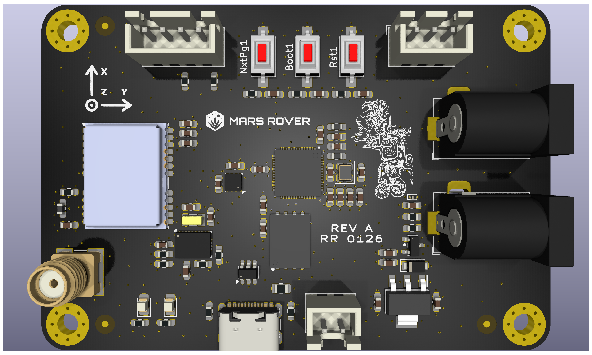
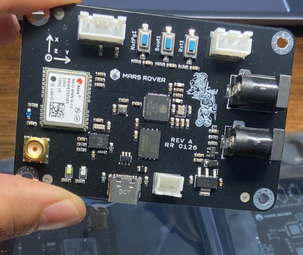

# Kukulcan Hardware

This directory contains the MCU hardware design and tracked fabrication artifacts for the Kukulcan rover controller board.

Current documented board target: `Kukulcan Rev A`, described as validated RevA integration hardware.

## Contents

- `MCU/`: main KiCad project, board file, schematic, local outputs, and board exports
- `Libraries/`: shared symbols, footprints, and 3D models used by the design
- `mfr/`: tracked manufacturing outputs, Gerbers, drills, fab zip, BOM, and CPL

## Primary design files

- Project: `MCU/MCU.kicad_pro`
- Schematic: `MCU/MCU.kicad_sch`
- PCB: `MCU/MCU.kicad_pcb`
- Board solid: `MCU/MCU.stl`
- Exported board model: `MCU/outputs/MCU_board.step`
- Exported schematic PDF: `MCU/outputs/MCU_schematic.pdf`

## Board overview

Kukulcan Rev A is a 4-layer ESP32-based rover controller board intended to bridge embedded control, onboard sensing, and Jetson-side ROS integration.

Key design points:

- MCU: `ESP32-S3R8` with additional `32 MB` flash
- PCB size: `78 x 53 mm`
- PCB thickness: `1.6 mm`
- Copper weight: `1 oz`
- Surface finish: `HASL with lead`
- Mounting: `M3` mounting holes
- Debug/programming: USB JTAG support for programming and debugging

## Power architecture

The board uses a protected `5 V` input architecture with separate power intent for core electronics and auxiliary lighting.

- Allowed input: `5 V`
- Main power entry: two barrel-jack inputs
- Main regulated logic rail: `3.3 V` generated from `5 V` through a `TLV1117-33` LDO
- Auxiliary power rail: separate `5 V` rail for the LED strip
- Power implementation emphasis: three power planes across the 4-layer board

Documented protection features:

- fuse protection
- reverse-polarity protection
- ESD protection
- TVS protection

## Integrated and exposed interfaces

Integrated devices:

- GNSS: `u-blox NEO-M8N`, mounted directly on the PCB
- Barometer/environmental sensor: `BME280`
- IMU: `BNO055`

External connectivity:

- Jetson interface: `40-pin` header intended for ribbon-cable connection to the Jetson Orin Nano as a broader expansion/control interface
- Jetson link currently includes UART plus two GPIO lines connected to the ESP32
- Jetson-side dedicated I2C is reserved for the `BMI088` IMU
- RoboClaw communications: exposed UART
- Expansion bus: exposed I2C header for additional peripherals
- GNSS antenna: coaxial connector for an active GNSS antenna

Planned but not yet implemented:

- external `2.4"` diagnostics display on the exposed I2C bus

## Validation status

Kukulcan Rev A is validated RevA integration hardware.

Maintainer-reported validation status:

- stable embedded firmware can run on the board
- most hardware functions have been validated on real hardware
- GNSS validation is still pending
- diagnostics display support is still pending

## Manufacturing status

Tracked fabrication data already exists for `MCU RevA`:

- Gerbers and drills in `mfr/`
- Fabrication archive in `mfr/MCU_revA_fab.zip`
- Assembly files in `mfr/pcba/`

If the PCB changes, regenerate these outputs in the same commit or a clearly paired follow-up commit.

## Validation evidence

### PCB render

Current board render for Kukulcan Rev A.

### Real hardware

Assembled Kukulcan Rev A board photographed on real hardware.
